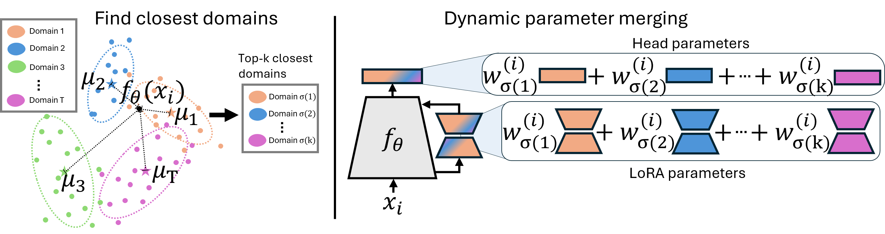
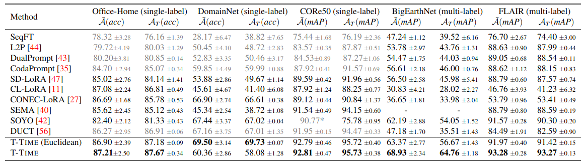

# T-Time: Test-Time Merging for Domain Incremental Learning

Welcome to the official code repository for T-Time: Test-Time Merging for Domain-Incremental Learning.

## 👀 Introduction


- T-Time is a domain-incremental learning method that learns domain-specific adapters and performs sample-wise parameter composition at inference time, enabling replay-free adaptation without domain identifiers.
- It uses a distance-aware test-time merging mechanism that interpolates model parameters based on statistical similarity in a frozen feature space, avoiding learned routing networks while remaining interpretable.
- T-Time achieves state-of-the-art performance among rehearsal-free domain-incremental learning methods for pre-trained models on both remote sensing and general vision datasets under different types of classification tasks.

## 📜 Results


## 📂 Datasets:
The datasets can be downloaded from the following sources:

[Office-Home](https://www.hemanthdv.org/officeHomeDataset.html)
 – A dataset with images from 4 domains (Art, Clipart, Product, Real-World) across 65 categories.

 [DomainNet](https://ai.bu.edu/M3SDA/#refs)
 – A dataset with images from 6 domains (Clipart, Infograph, Painting, Quickdraw, Real, Sketch) across 345 categories.

 [CORe50](https://vlomonaco.github.io/core50/)
 – A dataset with images from 11 sessions with 50 different categories.

[BigEarthNet](https://bigearth.net/)
 – A large-scale remote sensing dataset for multi-label land cover classification.

[FLAIR](https://ignf.github.io/FLAIR/FLAIR1/flair_1.html)
 – A high-resolution aerial image dataset for image segmentation and domain adaptation.

## ▶️ Run:
To run the experiments create an environment using [requirements.txt](requirements.txt). Configuration files can be found in [exps](exps). Download the datasets to /data/ and execute:
   ```bash
  bash run.sh